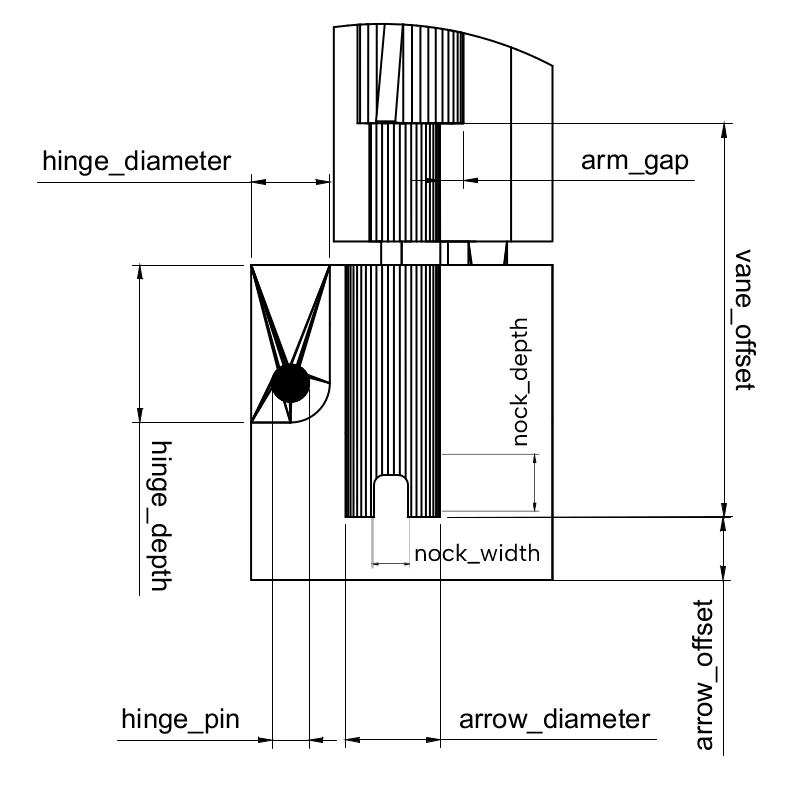
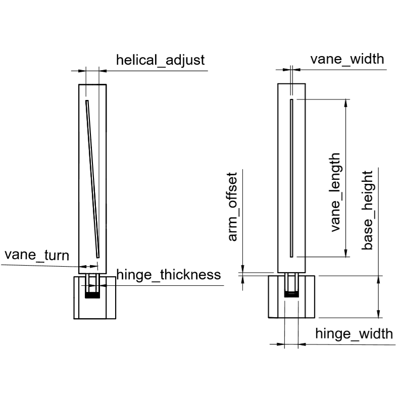

# OpenSCAD Fletching jig

## Overview
Simple yet effective fletching jig that will adjust to all your needs. Intended to provide new archers with access to 3D printer (such as myself) cheap way to fix broken arrows without a need for expensive off-the-shelf jig. Hopefully, even skilled shooters will find utility in this design.

### Features

+ highly adjustable to fit different arrows and vanes
+ straight, offset and **true** helical fletchings
+ no additional tools required for assembly
+ hot swappable arms
+ very compact and light 

## Prerequisites

First you have to download latest version (2019.05 or newer) of [OpenSCAD](http://www.openscad.org/downloads.html). It's free and open source software available for all major desktop platforms. Nothing else is needed for editing and rendering. 

Additional software required will vary depending on your 3D printer.

## How to use

Download and extract latest release somewhere on your PC. Then open [main.scad](./scad/main.scad) file in OpenSCAD. You can close the editor on the left.

You should see customizer window on the right. There you can change parameters listed below. Nothing prevents you from inserting invalid values, messing up the design in the process - so be reasonable. I'd advise you to change parameters you're sure about first (arrow_diameter, vane_length etc.) and then adjust the rest.

Press *F6* when you're happy with the result and then navigate to *File > Export > Export as STL* to save rendered mesh as a file.

Parameter | Description
--- | ---
arrow_diameter | slightly bigger than the arrow itself (may vary depending on your printer)
arrow_offset | distance between the bottom of the base and arrow
base_height | height of the base
hinge_width | width of the hinge cutout on the base
hinge_diameter | diameter of the circular part of the hinge that forms a joint
hinge_depth | how deep into the base is the hinge cutout
hinge_pin | diameter of the sphere that connects two halves of the hinge together 
arm_gap | gap for the vane foot, so that tension during clamping is distributed evenly
arm_offset | distance between the top of the base and bottom of the arm
vane_length | length of the vane
vane_width | width of the vane
vane_offset | how far from the end of the arrow will the vane be
vane_turn | sets OFFSET fletching in degrees
helical | if true, HELICAL fletching will be used
helical_adjust | horizontal distance between the bottom and top corner of the HELICAL vane
helical_direction | sign of the value determines left or right spin (+ left; - right)

## Printing recommendations

These settings were tested on Prusa MK2S. You might need to adjust them slightly.

Part | Layer height | Infill | Supports | Bed placement
--- | --- | --- | --- | --- 
Arm | 0.15mm or better | 15% | none / 3mm brim | 
Base | 0.2mm or better  | 15% | none | 
Lid | 0.35mm | solid | none | 

***

 This work is licensed under a <a rel="license" href="http://creativecommons.org/licenses/by-nc-sa/4.0/">Creative Commons Attribution-NonCommercial-ShareAlike 4.0 International License</a>.